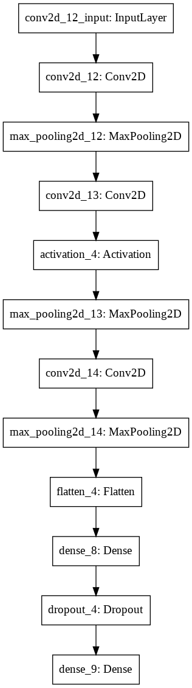

# Deep_learning

## Dataset
1. Food 101
2. Yelp Dataset

## Issues in the dataset(Work around)
One existing issue in the dataset is that in yelp, there is no cleaned data. The solution we came up is to use simply NLP to classify the food.

In other words, if the comments have a matching food crictical word, we will use this to label the food.

If the critical word appears more than 1 times, the food will be falled into multiple category.

# Model 

The original label came from another problem(human emotional classification).
However, that model is not a good one for our question due to overfit. So we have took way to optimze the model.

## Original model

# Environment

The environment is configured using Google colab

[Base Code](https://colab.research.google.com/drive/1xIIr7XbOJLIeu_lJv2ZynoRxh4RVsS3S#scrollTo=2ZKL6nKYq0fp)

[Food101_Overfit](https://colab.research.google.com/drive/182Ljva9-keWofv6nelODcx5qlcJ_Vm-S?usp=sharing)

[Food101](https://colab.research.google.com/drive/1PpyLU6aVUKLcE0EOeXfY6cq9dmcmDpeG?usp=sharing)

[Yelp Dataset](https://colab.research.google.com/drive/1gv_KvDi-izgcU53RuVU1YuvLre-x9ZNt?usp=sharing)

# Interesting part
1. Compare the dataset we generated manually with the 'good' dataset the is already lablled
2. Compare the model for different CV problem, and took ways to reduce overfitting.
